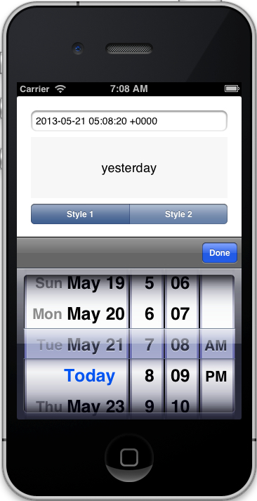
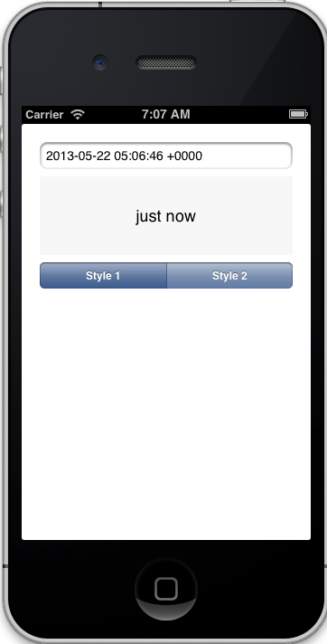
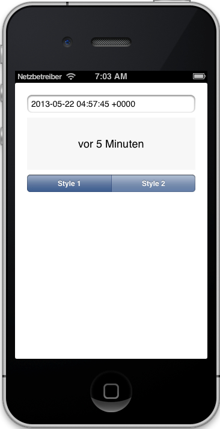
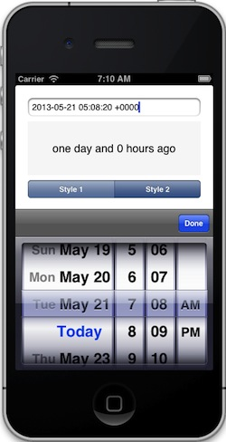
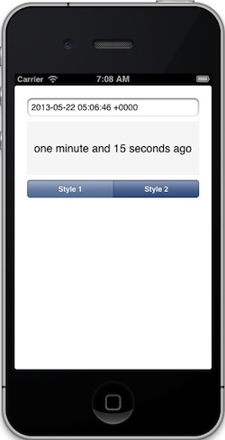
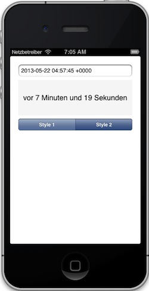

NSDate+PrettyDate
=================

An Objective-C category to calculate relative time spans between an **NSDate**
object and the current date.

The result is simmilar to the commit times of GitHub, e.g. **2 hours ago**.

Installation
------------

Just drop the files `NSDate+PrettyDate.m` and `NSDate+PrettyDate.h`
in your project. If you like, you can also put the german translation
folder `de.lproj` in your project.

Example
-------

ViewController.m::

    #import "NSDate+PrettyDate.h"

    - (void) viewDidLoad
    {
        [super viewDidLoad];

        NSDate *date = [NSDate dateWithTimeIntervalSinceNow:-3600];

        self.label.text = [date prettyDate]; // results "1 hour ago"
        //self.label.text = [date prettyDate2]; // results "1 hour ago and 15 seconds ago"
    }

Localization
------------

To localize the resulting strings, do the following steps:

#. Add a file `Localizable.strings` to your project.
   (File>New>File... Resources>Strings File)

#. Add the desired language to your project
   (Click on Project>Localizations> +)

#. Click on the `Localizable.strings` file, click `Localize` in the File inspector.

#. Add the following contents::

    // PrettyDate
    "just now"       = "in diesem Moment";
    "a minute ago"   = "vor einer Minute";
    "last hour"      = "letzte Stunde";
    "yesterday"      = "gestern";
    "last week"      = "letzte Woche";
    "last month"     = "letzten Monat";
    "last year"      = "letztes Jahr";

    "%d seconds ago" = "vor %d Sekunden";
    "%d minutes ago" = "vor %d Minuten";
    "%d hours ago"   = "vor %d Stunden";
    "%d days ago"    = "Vor %d Tagen";
    "%d weeks ago"   = "vor %d Wochen";
    "%d months ago"  = "vor %d Monaten";
    "%d years ago"   = "vor %d Jahren";

    // PrettyDate2
    "%d seconds ago ..."            = "vor %d Sekunden ...";
    "a few seconds ago"             = "vor ein paar Sekunden";

    "%d minutes and %d seconds ago" = "vor %d Minuten und %d Sekunden";
    "one minute and %d seconds ago" = "vor einer Minute und %d Sekunden";

    "%d hours and %d minutes ago"   = "vor %d Stunden und %d Minuten";
    "one hour and %d minutes ago"   = "vor einer Stunde und %d Minuten";

    "%d days and %d hours ago"      = "vor %d Tagen und %d Stunden";
    "one day and %d hours ago"      = "vor einem Tag und %d Stunden";

    "%d weeks and %d days ago"      = "vor %d Wochen und %d Tagen";
    "one week and %d days ago"      = "vor einer Woche und %d Tagen";

    "%d months and %d days ago"     = "vor %d Monaten und %d Tagen";
    "one month and %d days ago"     = "vor einem Monat und %d Tagen";

    "%d years and %d months ago"    = "vor %d Jahren und %d Monaten";
    "one year and %d months ago"    = "vor einem Jahr und %d Monaten";

.. note:: The german translation is already included in the NSDate+PrettyDate Project.

Demo Style 1
------------

Demo Style 2
------------

License
-------

MIT. do what you want.
