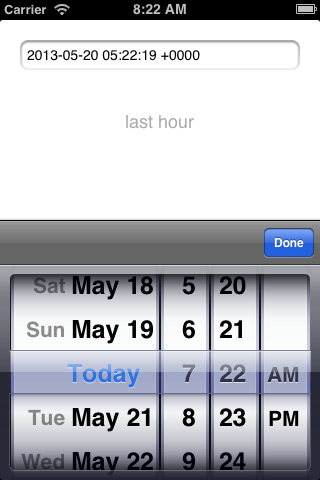
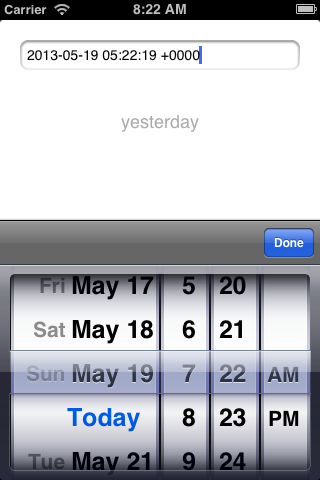

NSDate-PrettyDate
=================

An Objective-C category to calculate relative time spans between an `NSDate`
object and today.

The result is simmilar to the commit times of GitHub, e.g. `2 hours ago`.

Example
-------

ViewController.m::

    #import "NSDate+PrettyDate.h"

    - (void) viewDidLoad
    {
        [super viewDidLoad];

        NSDate *date = [NSDate dateWithTimeIntervalSinceNow:-3600];

        self.label.text = [date prettyDate]; // results "1 hour ago"
    }

Localization
------------

To localize the resulting strings, do the following steps:

#. Add a file `Localizable.strings` to your project.
   (File>New>File... Resources>Strings File)

#. Add the desired language to your project
   (Click on Project>Localizations> +)

#. Click on the `Localizable.strings` file, click `Localize` in the File inspector.

#. Add the following contents::

    "just now"       = "in diesem Moment";
    "a minute ago"   = "vor einer Minute";
    "last hour"      = "letzte Stunde";
    "yesterday"      = "gestern";
    "last week"      = "letzte Woche";
    "last month"     = "letzten Monat";
    "last year"      = "letztes Jahr";

    "%d seconds ago" = "vor %d Sekunden";
    "%d minutes ago" = "vor %d Minuten";
    "%d hours ago"   = "vor %d Stunden";
    "%d days ago"    = "Vor %d Tagen";
    "%d weeks ago"   = "vor %d Wochen";
    "%d months ago"  = "vor %d Monaten";
    "%d years ago"   = "vor %d Jahren";

.. note:: The german translation is already included in the NSDate+PrettyDate Project.

Demo
----

